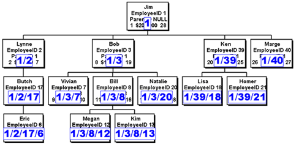
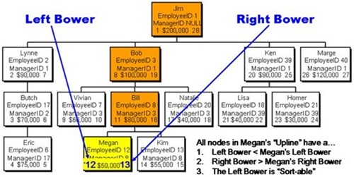
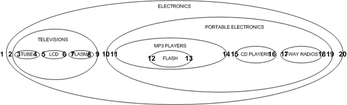

# Task3

## Database-specific types

* [hierarchyid in T-SQL](https://docs.microsoft.com/en-us/sql/t-sql/data-types/hierarchyid-data-type-method-reference?view=sql-server-ver15)
* [ltree in Postgresql](https://www.postgresql.org/docs/current/ltree.html)

## In general

### Adjacency List Model

This is the approach I come up with. Easiest to read and logic is straightforward.

Advantage

* Small storage size
* Easy and intuitive for human to understand maintain
* To move a node put a docswith its child nodes, just change its parentId

Disadvantage

* Expanding the whole path requires walking through the nodes
* Poor Performance with large depth

### Hierarchical Path / Materialized Path

Advantage

* Nodes can be sort by path
* Less loops and recursion in code

Disadvantage

*  Moving one node with child nodes would require all child nodes be updated

### Nested Set Model

Advantage

* Can find all nodes directly under / above specific node fast by comparing left and right bowers
* Expanding the whole path can be done with finding all upline nodes and sort their left bower

Disadvantage

* Calculating left and right bowers could be confusing for beginners but library should have handles them

Reference:

(https://docs.microsoft.com/en-us/archive/blogs/mvpawardprogram/hierarchies-convert-adjacency-list-to-nested-sets)

(http://mikehillyer.com/articles/managing-hierarchical-data-in-mysql/)
